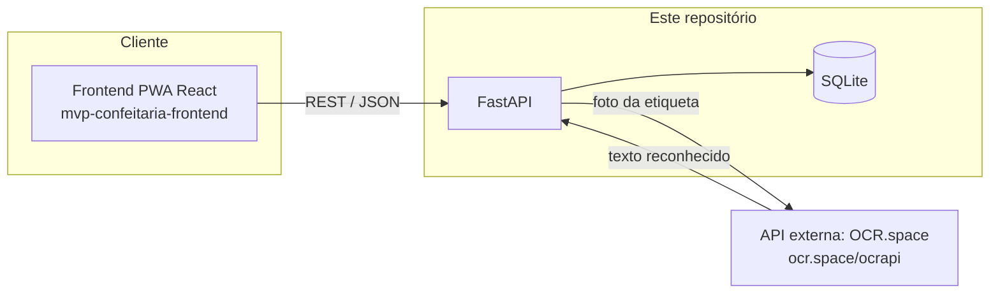

# Confeitaria — Backend API

API REST (FastAPI + SQLite) do sistema de gestão de compras para confeitaria. Responsável por persistir listas de compras, fornecedores, produtos e histórico de preços, e por orquestrar a leitura de etiquetas de mercado via uma API externa de OCR.

Este repositório é o módulo **"API (Back-End)"** do MVP de componentização/microsserviços. O módulo de interface (frontend) está no repositório [`mvp-confeitaria-frontend`](https://github.com/Arthur5252/mvp-confeitaria-frontend).

## Arquitetura



- O **frontend** nunca fala diretamente com a API externa de OCR: ele envia a foto para este backend, que repassa para o OCR.space mantendo a chave de API protegida no servidor.
- A extração de **nome do produto, preço e quantidade mínima (tiers de atacado)** a partir do texto bruto do OCR é lógica própria deste backend (`app/interpretacao.py`), não da API externa.

## API externa utilizada: OCR.space

- **Serviço**: [OCR.space](https://ocr.space/ocrapi) — API REST gratuita de OCR (reconhecimento de texto em imagens).
- **Licença/custo**: tier gratuito, sem necessidade de cartão de crédito (limite de 25.000 requisições/mês na chave gratuita).
- **Cadastro**: crie uma chave gratuita em https://ocr.space/ocrapi/freekey e defina em `CHAVE_API_OCR_SPACE` no `.env`.
- **Rota utilizada**: `POST https://api.ocr.space/parse/image` (multipart, campo `file` com a imagem, enviado pelo backend, `language=por`, `OCREngine=2`).
- Os dados retornados (texto bruto) são consumidos e processados inteiramente por este backend (`/ocr/escanear`) — em nenhum momento o usuário é redirecionado para o site do OCR.space.

## Modelo de dados

`fornecedores`, `produtos`, `apelidos_produto`, `registros_preco`, `listas_compras`, `itens_lista_compras` — ver `app/modelos.py`.

## Rotas principais

| Método | Rota | Descrição |
|---|---|---|
| POST | `/autenticacao/entrar` | Autenticação simples (usuário único), retorna JWT |
| GET/POST | `/fornecedores` | Listar/criar fornecedores |
| GET/PUT/DELETE | `/fornecedores/{id}` | Detalhe/editar/remover fornecedor |
| GET/POST | `/produtos` | Listar/criar produtos |
| GET/POST | `/listas-compras` | Listar/criar listas de compras |
| GET/PUT/DELETE | `/listas-compras/{id}` | Detalhe/editar/remover lista |
| POST | `/listas-compras/{id}/itens` | Adicionar item à lista |
| PATCH/DELETE | `/listas-compras/{id}/itens/{item_id}` | Marcar como comprado / editar / remover item |
| POST | `/ocr/escanear` | Envia foto da etiqueta, retorna candidato {nome, preço, qtd mínima} |
| GET/POST | `/registros-preco` | Histórico de preços |
| PUT/DELETE | `/registros-preco/{id}` | Editar/remover um registro de preço |
| GET | `/painel/comparacao-precos` | Compara preço mais recente entre fornecedores |
| GET | `/painel/historico-precos` | Variação de preço ao longo do tempo |
| GET | `/painel/destaques` | Destaques automáticos (fornecedor mais barato, altas de preço) |

Documentação interativa (Swagger) disponível em `/docs` após subir a aplicação.

## Dados de demonstração

Para popular o banco com fornecedores, produtos e histórico de preços fictícios (útil para o vídeo de entrega, sem precisar escanear etiquetas de verdade):

```bash
python scripts/popular_demo.py
```

Com Docker Compose rodando (a partir do repositório `mvp-confeitaria-frontend`):

```bash
docker compose exec backend python scripts/popular_demo.py
```

**Atenção:** o script apaga todos os dados existentes antes de popular.

## Instalação e execução local (sem Docker)

```bash
python -m venv .venv
source .venv/bin/activate  # Windows: .venv\Scripts\activate
pip install -r requirements.txt
cp .env.example .env  # edite com sua chave do OCR.space e senha de login
uvicorn app.main:app --reload
```

A API sobe em `http://localhost:8000`. Documentação: `http://localhost:8000/docs`.

## Execução com Docker

```bash
docker build -t confeitaria-backend .
docker run -p 8000:8000 --env-file .env -v $(pwd)/data:/app/data confeitaria-backend
```

O `docker-compose.yml` que sobe backend + frontend juntos está na raiz do repositório [`mvp-confeitaria-frontend`](https://github.com/Arthur5252/mvp-confeitaria-frontend). Ele espera as pastas `backend` e `frontend` lado a lado, então clone informando o nome da pasta:

```bash
git clone https://github.com/Arthur5252/mvp-confeitaria-backend.git backend
git clone https://github.com/Arthur5252/mvp-confeitaria-frontend.git frontend
```

## Variáveis de ambiente

Ver `.env.example`. Ele já traz um usuário e uma senha de **avaliação** (`avaliador` / `confeitaria123`), públicos de propósito para quem for avaliar o projeto. **Antes de rodar em produção** (ex.: no notebook exposto via redirecionamento de portas), gere valores próprios para `SENHA_APP` e `SEGREDO_JWT`:

```bash
python -c "import secrets; print(secrets.token_urlsafe(48))"   # para SEGREDO_JWT
python -c "import secrets; print(secrets.token_urlsafe(12))"   # para SENHA_APP
```
