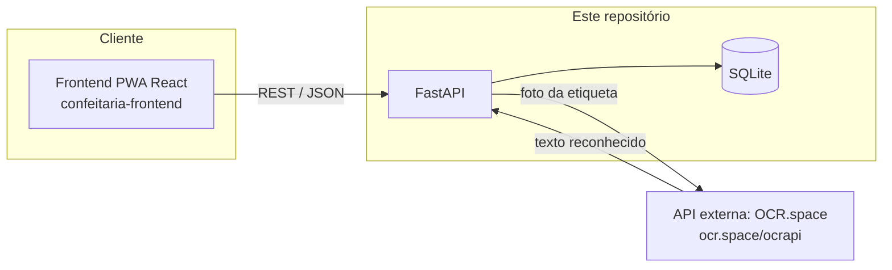

# Confeitaria — Backend API

API REST (FastAPI + SQLite) do sistema de gestão de compras para confeitaria. Responsável por persistir listas de compras, fornecedores, produtos e histórico de preços, e por orquestrar a leitura de etiquetas de mercado via uma API externa de OCR.

Este repositório é o módulo **"API (Back-End)"** do MVP de componentização/microsserviços. O módulo de interface (frontend) está no repositório [`confeitaria-frontend`](https://github.com/SEU_USUARIO/confeitaria-frontend).

## Arquitetura



- O **frontend** nunca fala diretamente com a API externa de OCR: ele envia a foto para este backend, que repassa para o OCR.space mantendo a chave de API protegida no servidor.
- A extração de **nome do produto, preço e quantidade mínima (tiers de atacado)** a partir do texto bruto do OCR é lógica própria deste backend (`app/parsing.py`), não da API externa.

## API externa utilizada: OCR.space

- **Serviço**: [OCR.space](https://ocr.space/ocrapi) — API REST gratuita de OCR (reconhecimento de texto em imagens).
- **Licença/custo**: tier gratuito, sem necessidade de cartão de crédito (limite de 25.000 requisições/mês na chave gratuita).
- **Cadastro**: crie uma chave gratuita em https://ocr.space/ocrapi/freekey e defina em `OCR_SPACE_API_KEY` no `.env`.
- **Rota utilizada**: `POST https://api.ocr.space/parse/image` (multipart, campo `file` com a imagem, `language=por`, `OCREngine=2`).
- Os dados retornados (texto bruto) são consumidos e processados inteiramente por este backend (`/ocr/scan`) — em nenhum momento o usuário é redirecionado para o site do OCR.space.

## Modelo de dados

`suppliers`, `products`, `product_aliases`, `price_records`, `shopping_lists`, `shopping_list_items` — ver `app/models.py`.

## Rotas principais

| Método | Rota | Descrição |
|---|---|---|
| POST | `/auth/login` | Autenticação simples (single-user), retorna JWT |
| GET/POST | `/suppliers` | Listar/criar fornecedores |
| GET/PUT/DELETE | `/suppliers/{id}` | Detalhe/editar/remover fornecedor |
| GET/POST | `/products` | Listar/criar produtos |
| GET/POST | `/shopping-lists` | Listar/criar listas de compras |
| GET/PUT/DELETE | `/shopping-lists/{id}` | Detalhe/editar/remover lista |
| POST | `/shopping-lists/{id}/items` | Adicionar item à lista |
| PATCH/DELETE | `/shopping-lists/{id}/items/{item_id}` | Marcar como comprado / editar / remover item |
| POST | `/ocr/scan` | Envia foto da etiqueta, retorna candidato {nome, preço, qtd mínima} |
| GET/POST | `/price-records` | Histórico de preços |
| PUT/DELETE | `/price-records/{id}` | Editar/remover um registro de preço |
| GET | `/dashboard/price-comparison` | Compara preço mais recente entre fornecedores |
| GET | `/dashboard/price-history` | Variação de preço ao longo do tempo |
| GET | `/dashboard/insights` | Insights automáticos (fornecedor mais barato, altas de preço) |

Documentação interativa (Swagger) disponível em `/docs` após subir a aplicação.

## Dados de demonstração

Para popular o banco com fornecedores, produtos e histórico de preços fictícios (útil para o vídeo de entrega, sem precisar escanear etiquetas de verdade):

```bash
python scripts/seed_demo.py
```

**Atenção:** o script apaga todos os dados existentes antes de popular.

## Instalação e execução local (sem Docker)

```bash
python -m venv .venv
source .venv/bin/activate  # Windows: .venv\Scripts\activate
pip install -r requirements.txt
cp .env.example .env  # edite com sua chave do OCR.space e senha de login
uvicorn app.main:app --reload
```

A API sobe em `http://localhost:8000`. Documentação: `http://localhost:8000/docs`.

## Execução com Docker

```bash
docker build -t confeitaria-backend .
docker run -p 8000:8000 --env-file .env -v $(pwd)/data:/app/data confeitaria-backend
```

(O `docker-compose.yml` que sobe backend + frontend juntos está na raiz do repositório [`confeitaria-frontend`](https://github.com/SEU_USUARIO/confeitaria-frontend).)

## Variáveis de ambiente

Ver `.env.example`. **Antes de rodar em produção** (ex.: no notebook exposto via port forwarding), gere valores próprios para `APP_PASSWORD` e `JWT_SECRET` — nunca use os valores de exemplo do repositório:

```bash
python -c "import secrets; print(secrets.token_urlsafe(48))"   # para JWT_SECRET
python -c "import secrets; print(secrets.token_urlsafe(12))"   # para APP_PASSWORD
```
